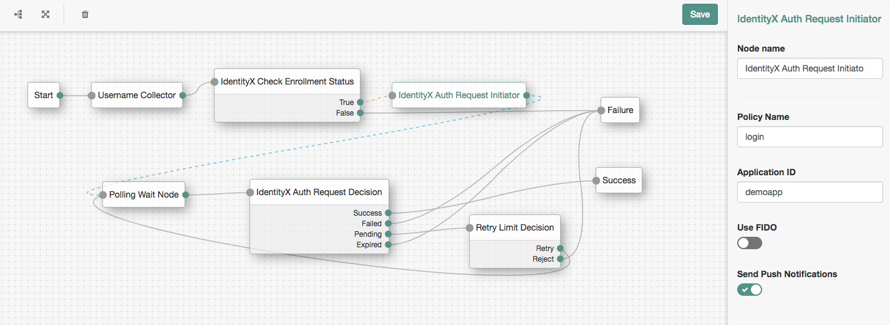
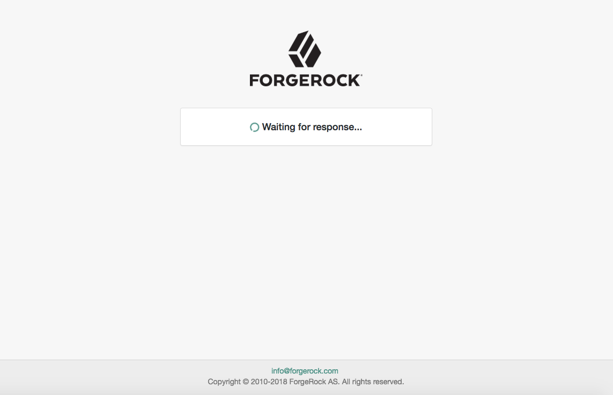

# IdxAuthRequestNode

Daon's IdentityX platform is helping customers across the globe ditch passwords and deliver world-class customer experience by leveraging biometrics. This set of nodes allows ForgeRock customers to easily add biometrics to their authentication trees.

## About Daon ##
Daon, [www.daon.com](www.daon.com), is an innovator in developing and deploying biometric authentication and identity assurance solutions worldwide. Daon has pioneered methods for securely and conveniently combining biometric and identity capabilities across multiple channels with large-scale deployments that span payments verification, digital banking, wealth, insurance, telcos, and securing borders and critical infrastructure. Daon's IdentityX® platform provides an inclusive, trusted digital security experience, enabling the creation, authentication and recovery of a user’s identity and allowing businesses to conduct transactions with any consumer through any medium with total confidence. Get to know us on [Twitter](https://twitter.com/DaonInc), [Facebook](https://www.facebook.com/humanauthentication) and [LinkedIn](https://www.linkedin.com/company/daon).

## Installation ##
Download the current release [here](https://github.com/JBeloncik/idx-auth-request-node/releases/latest)

Copy the jar file into the ../web-container/webapps/openam/WEB-INF/lib directory where AM is deployed.  Restart the web container to pick up the new node.  The nodes will then appear in the authentication trees components palette.

## USING THE NODES IN YOUR TREE ##

### There are 4 nodes included ###
- **IdxCheckEnrollmentStatus** This node makes a REST API call to IdentityX to ensure the username provided is enrolled. This node contains the configuration parameters for the IdentityX Rest Services, so it is required to be added to the tree in order for the other nodes to work.
- **IdxAuthRequestNode** This node makes a REST API call to IdentityX to generate and authentication request.
- **IdxAuthStatusNode** This node makes a REST API call to IdentityX to check the status of an authentication request.
- **IdxSponsorUser** This node will add sponsorship/registration in a future release.

### CONNECTING TO AN IDENTITYX SERVER ###
The nodes must be configured to connect to an IdentityX server. Contact your Daon representative for connection details.

### Configuration Parameters ###
IdxCheckEnrollmentStatus contains the following configurable parameters:
- **pathToKeyStore** full path to the .jks keystore file
- **pathToCredentialProperties** full path to the credential.properties file
- **jksPassword** password for the .jks keystore file
- **keyAlias** key alias used in the .jks keystore
- **keyPassword** key password for the .jks keystore

IdxAuthRequestNode contains the following configurable parameters:
- **policyName** name of the authentication policy which should be used
- **applicationId** name of the application which should be used
- **isFidoRequest** whether to generate a FIDO or traditional IdentityX authentication request
- **sendPushNotification** whether a push notification should be sent by the IdentityX server

The image below shows an example authentication tree using these nodes.

### Authenticating ###
The IdxCheckEnrollmentStatus node expects a username to be provided in sharedState. In the example tree above, a simple username collector is used. The IdxAuthRequestNode will then call IdentityX to generate an authentication request for the provided username. Once created, the IdxAuthStatusNode is used to check the status of the authentication request. A polling wait node and retry decision node can be used to poll for the status. Once the user successfully authenticates on their mobile device, the status will change to SUCCESS.

The user must authenticate using a mobile app which has been built using the IdentityX FIDO Client SDK.

## FUTURE UPDATES ##
- **Sponsorship/Registration** The current version requires the user to be enrolled in IdentityX using the same userId as the identity in OpenAM. The IdxSponsorUser node will add the API calls and logic to allow optional registration in IdentityX as a part of the authentication tree.

## SUPPORT ##
For more information on this node or to request a demonstration, please contact:
Frank Gasparovic - frank.gasparovic@forgerock.com
or
Jason Beloncik - jason.beloncik@daon.com

# idx-auth-request-node
